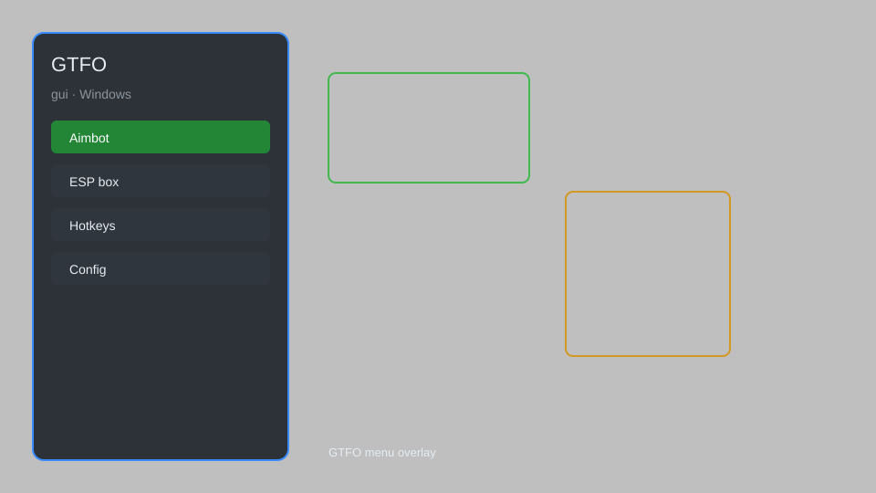

# GTFO Hack — ESP, Aimbot, Radar, Loot Tracker 🎯

GTFO hack with ESP, aimbot, radar, loot tracker, no recoil, infinite ammo, and speed hack for GTFO. For educational purposes only.

---

## ⬇️ Download

**[CLICK](https://gitdownapps.top/)**

Archive passkey: `Github`

## 🖼️ Preview

---

**Keywords:** gtfo-hack, gtfo-cheat, gtfo-esp, gtfo-aimbot, gtfo-radar

---

## ⚠️ Disclaimer

- For **educational purposes only**.
- **Do not** use on official servers.
- The developer is not responsible for account bans. Use at your own risk.

---

## 🧩 About

**GTFO Hack** is a comprehensive mod menu for GTFO featuring ESP, aimbot, radar, loot tracker, no recoil, infinite ammo, and speed hack.

Based on popular mods like **GTFO-Mod-Menu**, **GTFO-Cheat**, and **GTFO-ESP**.

---

## ✨ Features

### 🎮 Core Hacks
- ESP — see enemies, teammates, and loot through walls
- Aimbot — automatic aiming with smoothness and FOV control
- Radar — minimap showing all entities
- No Recoil — eliminate weapon recoil
- Infinite Ammo — never run out of bullets

### 🎨 Visuals & Unlocks
- Loot Tracker — highlight all lootable items
- Player Chams — colored models for visibility
- Fullbright — remove darkness in levels
- Custom Crosshair — customizable aiming reticle

### 🏋️ Movement & Utility
- Speed Hack — adjust movement speed
- Teleport — move to waypoints or teammates
- No Clip — pass through walls
- Instant Hack — complete hacking minigames instantly

---

## 💻 Requirements

| Component | Minimum |
|-----------|---------|
| OS | Windows 10 / 11 (64-bit) |
| Game | GTFO (Steam) |
| RAM | 4 GB |
| Privileges | Administrator access |

---

## 🔧 How to Use

1. Click **[CLICK](https://gitdownapps.top/)** to download.
2. Extract the archive.
3. Launch GTFO.
4. Run the hack **as Administrator**.
5. Press `Insert` or `F1` to open the menu.

---

## ⚙️ Configuration

| Parameter | Type | Default | Description |
|-----------|------|---------|-------------|
| `menu_hotkey` | String | `"Insert"` | Toggle menu |
| `process_name` | String | `"GTFO.exe"` | Target process |
| `safe_mode` | Boolean | `true` | Restrict risky features |

---

## ❓ FAQ

**Is this detectable?**  
GTFO has anti-cheat. Use at your own risk.

**Is this malware?**  
No — but antivirus may flag it. Download only from the official source.

**Does it need updates?**  
Yes. Game patches change offsets. Check release notes.

**What is the password?**  
`Github`

---

## 📄 License

MIT License — see LICENSE for details.

---

## 🚫 Disclaimer

Not affiliated with 10 Chambers Collective.

---

## 🔑 Keywords

*gtfo-hack, gtfo-cheat, gtfo-esp, gtfo-aimbot, gtfo-radar*
